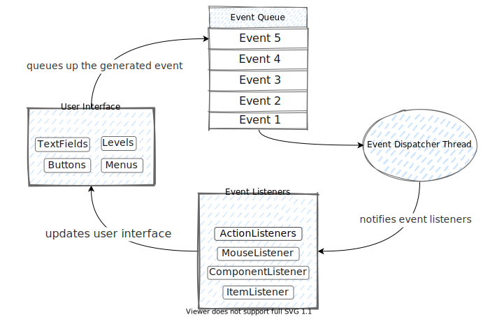

# Multithreading Swing

La programación en Swing no se trata solo de crear ventanas, etiquetas y botones. Crear interfaces es solo una parte del trabajo de los programadores de Swing. Estas interfaces son solo una forma de que el usuario interactúe con el sistema. Desarrollar una aplicación de GUI es más como desarrollar dos aplicaciones. Siempre se debe mantener el frontend separado de las tareas de fondo. Por ejemplo, el frontend no debe congelarse cuando el usuario intenta hacer clic en algo debido a que hay un proceso de fondo en ejecución. Ahí es donde se necesita multihilo. Este es el lado más pesado de las cosas.

## Tipos de hilos utilizados en Swing
Hay tres tipos de hilos que se utilizarán en las aplicaciones de Swing:

- Hilos iniciales: Los hilos iniciales son responsables de completar la inicialización inicial de nuestra GUI. El hilo inicial lleva la GUI hasta el punto en que se está ejecutando y lista para que se desate un evento.
- Hilo de despacho de eventos: Los hilos de despacho de eventos manejan situaciones en las que se activa un evento. Con estos hilos, podemos agregar código a una cola, donde se ejecutarán. Agregar tareas a la cola se puede hacer de dos maneras: como respuesta a la acción del usuario a través de un `ActionListener` o desde afuera de la acción del usuario a través de métodos especiales conocidos como `invokeAndWait` e `invokeLater`.
- Hilos de trabajadores (Worker Threads): Los hilos de trabajadores se utilizan para ejecutar servicios de fondo, específicamente servicios que tienen tiempos de ejecución largos. Por ejemplo, si quisiéramos crear un proceso que monitoree constantemente un servidor si hay nuevos mensajes, se usaría un hilo de trabajador.

El marco de Swing proporciona funcionalidad para cada uno de estos tipos de hilos. Todo lo que se debe hacer es utilizar las opciones disponibles para ofrecer a los clientes una experiencia agradable.

## Hilos iniciales

En la programación basada en eventos, la ejecución se basa en eventos causados por la interacción del usuario con una GUI (interfaz gráfica de usuario). Para que el usuario pueda interactuar con la GUI, necesita poder ver la GUI y todos los componentes asociados con ella. El propósito del hilo inicial es poner en funcionamiento la GUI para que el usuario pueda comenzar a interactuar con ella.

Hay dos métodos que podemos usar para crear nuestros hilos iniciales, que son `invokeLater` y `invokeAndWait`. El método `invokeLater` programa nuestra GUI para iniciar en el planificador de eventos. Cuando el planificador de eventos esté listo, iniciará la GUI y estará disponible para el usuario. Por el contrario, el método `invokeAndWait` no solo programa nuestra GUI para iniciar en el planificador de eventos, sino que también espera a que la GUI se inicie antes de continuar con cualquier otro código. El método `invokeAndWait` se utiliza principalmente en situaciones donde el código que requiere que la GUI esté activa se ejecuta después de la inicialización de la GUI.

Por ejemplo:

```java
SwingUtilities.invokeLater(new Runnable() {
    public void run() {
        createAndShowGUI();
    }
});
```

`invokeLater` y `invokeAndWait` se usan de la misma manera. Si se quiere usar `invokeAndWait`, se puede usar el mismo código que se muestra arriba, simplemente reemplazando el nombre del método `invokeLater` por `invokeAndWait`. Este código programará un objeto `Runnable` en el planificador de eventos. Cuando el objeto sea llamado por el planificador de eventos, se ejecutará el método run, que en este caso ejecuta un método llamado `createAndShowGUI`.

## Hilos de despacho de eventos

Un problema que ocurre al trabajar con múltiples hilos es la interacción insegura entre los hilos. Si invocamos múltiples hilos, las interacciones entre ellos pueden dar lugar a comportamientos inesperados. Los métodos que utiliza Swing no se consideran "seguros para hilos". Esto significa que si tenemos múltiples hilos ejecutando métodos de Swing, podemos encontrar comportamientos inesperados entre los hilos. Para evitar este problema, la mayoría del código que invoca métodos de Swing se ejecutará en el `Event Dispatch Threads`.

Al igual que con nuestros hilos iniciales, podemos invocar hilos de eventos a través de los métodos `invokeLater` y `invokeAndWait()`. Estos métodos tienen las mismas propiedades que antes, con la única diferencia de dónde los ejecutamos. Como ejemplo, el siguiente código, que mostrará un diálogo de mensaje en la pantalla.

```java
void showDialog() throws Exception {
    Runnable showModalDialog = new Runnable() {
        public void run() {
            JOptionPane.showMessageDialog(myMainFrame, "Hello World!");
        }
    };
    SwingUtilities.invokeAndWait(showModalDialog);
}
```

Cuando se activa este código, invocará el método para mostrar el diálogo de mensaje y devolverá una vez que el hilo de despacho de eventos haya ejecutado el código. Este método funciona bien para los casos en los que necesitamos que un evento finalice antes de proceder a activar otros eventos.

Si queremos activar un evento y devolver inmediatamente, el método invokeLater es la solución ideal. Es importante tener en cuenta que si ejecutamos hilos de esta manera, debemos asegurarnos de que no interactúan entre sí. Esto se debe a que el paquete de Swing no es seguro para hilos. Si los hilos interactúan entre sí, puede dar lugar a comportamientos impredecibles, como interferencia de hilos y condiciones de carrera.

Dado que no podemos garantizar que los métodos de Swing que estamos ejecutando sean seguros para hilos, es beneficioso verificar si estamos en el heilo de despacho de ventos antes de intentar interactuar con cualquier código de despacho de eventos. Para hacerlo, podemos usar el método `isEventDispatchThread`. Este método devolverá true si el hilo actual es el hilo de despacho de eventos. Esto nos permite evitar situaciones en las que otro hilo intenta acceder a un hilo de despacho de eventos, evitando así comportamientos inesperados de hilos.

Este diagrama muestra cómo los eventos, los despachadores de eventos, los escuchadores de eventos y las interfaces de usuario interactúan entre sí:



## Hilos de trabajadores/fondo

La tercera y última parte de los hilos es con diferencia la más complicada. Swing introdujo los hilos de trabajadores para gestionar tareas de larga duración en segundo plano. Realizar cálculos masivos, leer muchos datos de la base de datos o leer archivos largos son ejemplos de tales tareas de larga duración en segundo plano. El concepto de hilos de trabajadores se implementa mediante la clase `javax.swing.SwingWorker`.

Para entender por qué colocamos estos eventos en un hilo de trabajador, consideremos si, en cambio, colocábamos eventos largos en el mismo hilo de despacho de eventos que nuestros otros eventos. Si un usuario hiciera clic en un evento largo, se agregaría a la cola de eventos. Si luego activara un segundo evento, estaría esperando en la cola hasta que se complete el evento largo. Esto daría la apariencia de que la aplicación se ha congelado, cuando en realidad solo está procesando un evento más largo. Incluso eventos como cerrar la ventana no funcionarían debido a que están atascados en la cola de despacho de eventos. Para evitar esto, podemos colocar el evento más largo en un hilo de trabajador, lo que nos permite separar las operaciones largas y permitir al usuario seguir interactuando con la GUI.

Por ejemplo, podemos crear un trabajador llamado `SwingWorkerExample` que extienda la clase `javax.swing.SwingWorker` de la siguiente manera:

```java
final JLabel updateLabel;
class SwingWorkerExample extends SwingWorker<String, Object> {
    @Override
    public String doInBackground() {
        // tarea de larga duración
        Thread.sleep(500);
        return textToUpdateLabel();
    }

    @Override
    protected void done() {
        try {
            updateLabel.setText(get());
        } catch (Exception ignoreForNow) {
        }
    }
}
```

Cuando extendemos la clase `SwingWorker`, implementamos el método `done` para describir lo que sucede cuando `SwingWorker` ha terminado de ejecutarse. También implementamos el método `doInBackground`, que describe lo que el trabajador hará cuando se ejecute.

Para ejecutar nuestro `SwingWorkerExample`, podemos agregarlo como un `ActionListener`, como se muestra a continuación.

```java
JButton b = new JButton("¡Ejecutar!");
b.addActionListener(new ActionListener() {
    public void actionPerformed(ActionEvent e) {
        new SwingWorkerExample().execute();
    }
});
```

Al hacer esto, al presionar el botón, se ejecutará nuestro `SwingWorkerExample`, que iniciará la ejecución del método `doInBackground`.

Es importante tener en cuenta que, aunque los hilos de trabajadores son útiles para separar tareas largas y permitir que el usuario siga interactuando con la GUI, debemos tener cuidado al utilizarlos. Los hilos de trabajadores no están diseñados para interactuar con componentes de la GUI, por lo que debemos asegurarnos de utilizar el hilo de despacho de eventos para realizar cualquier tarea que involucre componentes de la GUI. Además, es importante recordar que los hilos de trabajadores son hilos separados, por lo que debemos asegurarnos de sincronizar cualquier interacción entre ellos y otros hilos para evitar problemas de interferencia de hilos y condiciones de carrera.

## Estado intermedio

Aunque obtener el resultado final es suficiente en muchos casos, una de las buenas prácticas de UX es recibir retroalimentación intermedia de un proceso en segundo plano. Por ejemplo, mientras se descarga algo, el navegador muestra una barra de progreso, el porcentaje de bytes cargados y el tiempo restante estimado. Otro ejemplo familiar es una búsqueda de larga duración que puede mostrar resultados intermedios tan pronto como se encuentran y antes de que se complete la búsqueda. Ambos ejemplos utilizan un mecanismo de compartir resultados intermedios entre el hilo de fondo y los hilos de despacho de eventos. Swing ofrece métodos para la implementación de dicha interacción:

- `publish(V... chunks)` envía datos desde un hilo de fondo a un hilo de despacho de eventos,
- `process(List<V> chunks)` recibe los datos enviados en un hilo de despacho de eventos.

Aquí el tipo `V` es el segundo parámetro de la clase `SwingWorker<T, V>`.

Consideremos un ejemplo y creamos una parte de una aplicación que muestra el progreso de una tarea en segundo plano. El código a continuación muestra una ventana con una barra de progreso y un valor porcentual:

```java
class ProgressBarTask extends SwingWorker<Integer, Integer> {
    private int counter;
    private final JTextArea textArea;
    private final JProgressBar progressBar;

    ProgressBarTask(JTextArea textArea, JProgressBar progressBar) {
        this.textArea = textArea;
        this.progressBar = progressBar;
    }

    @Override
    public Integer doInBackground() throws Exception {
        while (counter < 100 && !isCancelled()) {
            Thread.sleep(100L);
            publish(counter++);

            setProgress(counter);
        }

        return counter;
    }

    @Override
    protected void process(List<Integer> chunks) {
        int value = chunks.get(0);

        textArea.setText("cargando " + value + "%");
        progressBar.setValue(value);
    }
}
```

Esta clase emula una tarea de larga duración durmiendo en cada iteración del bucle while. Un hilo de fondo envía regularmente el último valor del contador a un hilo de despacho de eventos invocando al método `publish`. El valor se maneja por un hilo de despacho de eventos en el método `process` que actualiza `textArea`.

El código a continuación lanza nuestro ejemplo:

```java
public class Main {
    public static void main(String[] args) throws Exception {
        JFrame frame = new JFrame();
        frame.setSize(300, 100);
        frame.setLayout(new BorderLayout());
        frame.setVisible(true);
        frame.setDefaultCloseOperation(JFrame.EXIT_ON_CLOSE);

        JLabel label = new JLabel("Tarea de larga duración");
        final JTextArea textArea = new JTextArea();
        final JProgressBar progressBar = new JProgressBar(0, 100);

        frame.add(label, BorderLayout.PAGE_START);
        frame.add(textArea);
        frame.add(progressBar, BorderLayout.PAGE_END);

        ProgressBarTask task = new ProgressBarTask(textArea, progressBar);
        task.execute();
        task.get();
        System.exit(0);
    }
}
```

Al ejecutar este código, se creará una ventana con una barra de progreso y un valor porcentual que se actualizará mientras se ejecuta la tarea de larga duración en segundo plano. Esto nos permite proporcionar retroalimentación intermedia al usuario mientras se lleva a cabo una tarea en segundo plano, lo que mejora la experiencia de usuario al interactuar con la aplicación.


