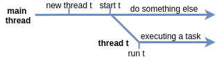

# Hilos

El hilo principal es un lugar de partida desde el cual se pueden crear nuevos hilos para realizar las tareas. Para hacerlo, se debe escribir código para que se ejecute en un hilo separado y luego iniciarlo.

## Crear hilos personalizados
Java tiene dos formas principales de crear un nuevo hilo que realice la tarea que se necesite:

### Heredando de la clase Thread y sobrescribiendo su método run

```java
class HelloThread extends Thread {
    @Override
    public void run() {
        String helloMsg = String.format("Hola, soy %s", getName());
        System.out.println(helloMsg);
    }
}
```

### Implementando la interfaz Runnable y pasando la implementación al constructor de la clase Thread.

```java
class HelloRunnable implements Runnable {
    @Override
    public void run() {
        String threadName = Thread.currentThread().getName();
        String helloMsg = String.format("Hola, soy %s", threadName);
        System.out.println(helloMsg);
    }
}
```

En ambos casos, se debe sobrescribir el método `run`, que es un método Java regular y contiene código para realizar una tarea. Qué enfoque elegir depende de la tarea y de tus preferencias. Si se hereda la clase `Thread`, se pueden aceptar campos y métodos de la clase base, pero no se pueden heredar otras clases ya que Java no tiene herencia múltiple de clases.

Aquí hay dos objetos obtenidos con los enfoques descritos anteriormente:

```java
Thread t1 = new HelloThread(); // una subclase de Thread

Thread t2 = new Thread(new HelloRunnable()); // pasando runnable
```

Y aquí hay otra forma de especificar el nombre de tu hilo pasándolo al constructor:

```java
Thread myThread = new Thread(new HelloRunnable(), "mi-hilo");
```

Con las expresiones lambda, se simplifica a:

```java
Thread t3 = new Thread(() -> {
    System.out.println(String.format("Hola, soy %s", Thread.currentThread().getName()));
});
```

Una vez creados los hilos, para realizar las tareas que se necesiten, hay que iniciarlos.

## Iniciando hilos
La clase `Thread` tiene un método llamado `start()` que se utiliza para iniciar un hilo. En algún momento después de invocar este método, se invocará automáticamente el método run, pero no sucederá inmediatamente.

Supongamos que dentro del método principal se crea un objeto de `HelloThread` llamado `t` y se inicia.

```java
Thread t = new HelloThread(); // un objeto que representa un hilo
t.start();
```

> Imprime por ejemplo: "Hola, soy Thread-0"

En esta  una imagen se que explica cómo realmente comienza un hilo y por qué no sucede inmediatamente.



Como se puede ver, hay algún retraso entre el inicio de un hilo y el momento en que realmente comienza a trabajar (ejecutarse).

Por defecto, un nuevo hilo se ejecuta en modo no daemon. 
> Recordatorio: la diferencia entre el modo daemon y el modo no daemon es que JVM no terminará el programa en ejecución mientras queden hilos no daemon, mientras que los hilos daemon no evitarán que JVM termine.

Diferencia entre `run` `start`. Se debe invocar `start` si se desea ejecutar el código dentro de `run` en un hilo separado. Si se invocas `run` directamente, el código se ejecutará en el mismo hilo.
Si se intenta iniciar un hilo más de una vez, `start` lanzará `IllegalThreadStateException`.
A pesar de que dentro de un solo hilo todas las instrucciones se ejecutan secuencialmente, es imposible determinar el orden relativo de las instrucciones entre múltiples hilos sin medidas adicionales.

Por ejemplo:

```java
public class StartingMultipleThreads {
    public static void main(String[] args) {
        Thread t1 = new HelloThread();
        Thread t2 = new HelloThread();

        t1.start();
        t2.start();

        System.out.println("Terminado");
    }
}
```

El orden de visualización de los mensajes puede ser diferente. Aquí hay uno de ellos:

```
Hola, soy Thread-1
Terminado
Hola, soy Thread-0
```

Incluso es posible que todos los hilos impriman su texto después de que el hilo principal imprima "Terminado":

```
Terminado
Hola, soy Thread-0
Hola, soy Thread-1
```

Esto significa que, aunque el hilo principal espera a que los hilos t1 y t2 terminen, no se puede predecir el orden en que se ejecutan los hilos.

## Esperar a que un hilo termine
Si se  esperar a que un hilo termine antes de continuar con la ejecución del hilo principal, se puede utilizar el método `join()`.

```java
Thread t1 = new HelloThread();
t1.start();
try {
    t1.join(); // wait for t1 to finish
} catch (InterruptedException e) {
    e.printStackTrace();
}
System.out.println("Terminado");
```

El método `join()` bloquea el hilo actual (en este caso, el hilo principal) hasta que el hilo al que se le ha invocado el método join haya finalizado su ejecución.

Si se necesita esperar a que varios hilos terminen, se puede invocar el método join en cada uno de ellos.

```java
Thread t1 = new HelloThread();
Thread t2 = new HelloThread();

t1.start();
t2.start();

try {
    t1.join();
    t2.join();
} catch (InterruptedException e) {
    e.printStackTrace();
}

System.out.println("Terminado");
```

Otra forma de esperar a que varios hilos terminen es utilizar el método `join` de la clase `Thread`.

```java
Thread t1 = new HelloThread();
Thread t2 = new HelloThread();

t1.start();
t2.start();

try {
    Thread.join(t1, t2);
} catch (InterruptedException e) {
    e.printStackTrace();
}

System.out.println("Terminado");
```

También se puede especificar un tiempo de espera al invocar el método `join`, de forma que el hilo actual se bloqueará hasta que el hilo al que se le ha invocado el método join haya finalizado su ejecución o hasta que se haya alcanzado el tiempo de espera.

```java
Thread t1 = new HelloThread();

t1.start();

try {
    t1.join(1000); // wait for t1 to finish for at most 1 second
} catch (InterruptedException e) {
    e.printStackTrace();
}

System.out.println("Terminado");
```

En este caso, si el hilo t1 no ha terminado su ejecución después de 1 segundo, el hilo principal continuará su ejecución sin esperar más.

Es importante tener en cuenta que el método `join` no detiene el hilo al que se le ha invocado. Simplemente bloquea el hilo actual hasta que el hilo al que se le ha invocado el método join haya finalizado su ejecución.

## Detener un hilo
Para detener un hilo, se puede utilizar el método `interrupt()` de la clase `Thread`. Este método enviará una señal de interrupción al hilo, lo que le permitirá salir de su bucle de ejecución en un momento conveniente.

Por ejemplo:

```java
class HelloThread extends Thread {

    @Override
    public void run() {
        String helloMsg = String.format("Hola, soy %s", getName());
        while (!isInterrupted()) {
            System.out.println(helloMsg);
        }
    }
}

Thread t1 = new HelloThread();

t1.start();
t1.interrupt();
```

El hilo t1 imprimirá "Hola, soy [nombre del hilo]" repetidamente hasta que se le envíe la señal de interrupción. Una vez que se recibe la señal, el hilo t1 sale de su bucle de ejecución y termina su ejecución.

También se puede comprobar si un hilo ha sido interrumpido utilizando el método `interrupted()` de la clase `Thread`. Este método devuelve `true `si el hilo actual ha sido interrumpido y `false` en caso contrario.

Por ejemplo:

```java
class HelloThread extends Thread {

@Override
public void run() {
    String helloMsg = String.format("Hola, soy %s", getName());
    while (!Thread.interrupted()) {
        System.out.println(helloMsg);
    }
}
}

Thread t1 = new HelloThread();

t1.start();

// algunas operaciones en el hilo t1
t1.interrupt();
```

Si deseas detener un hilo de manera más agresiva, se puede utilizar el método `stop()` de la clase `Thread`. Este método detiene inmediatamente el hilo y puede provocar problemas de sincronización y de memoria. Por lo tanto, se recomienda evitar utilizar el método `stop()` y utilizar el método `interrupt()` en su lugar.

## Resumen
En resumen, para crear y utilizar hilos en Java, se puede heredar la clase `Thread` y sobrescribir su método run, o implementar la interfaz `Runnable` y pasar la implementación al constructor de la clase `Thread`. Luego, se puede iniciar el hilo utilizando el método `start()` y esperar a que termine utilizando el método `join()`. También se puede detener un hilo utilizando el método `interrupt()`.